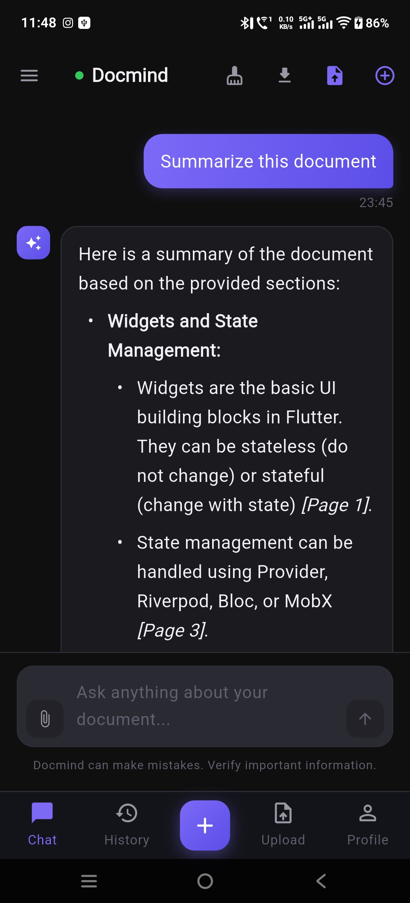
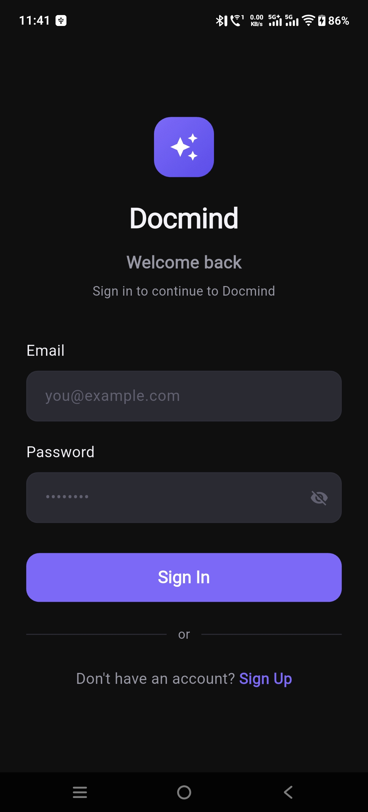
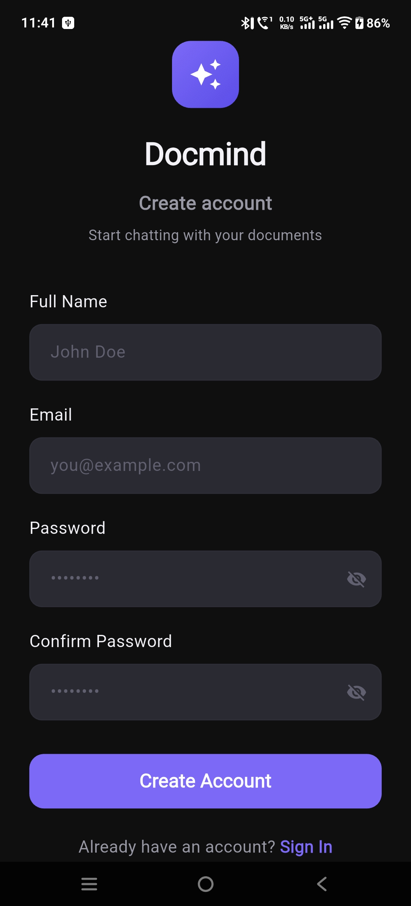
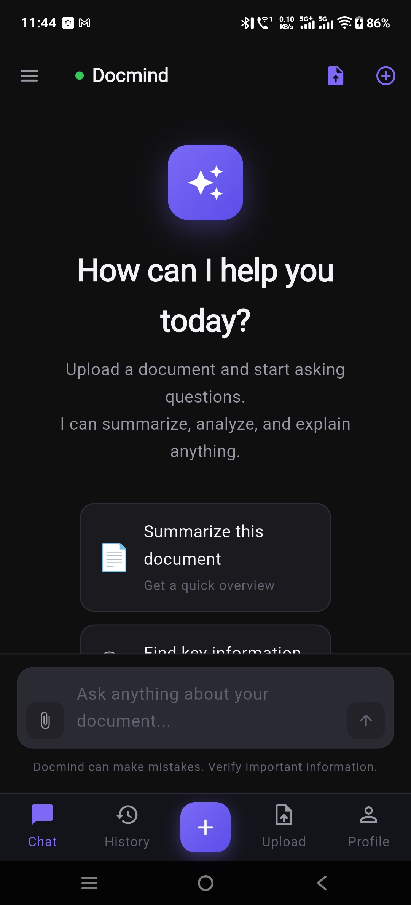
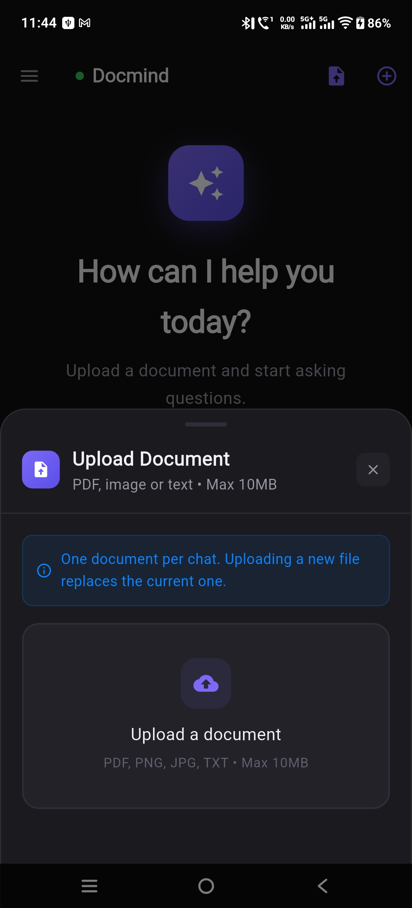
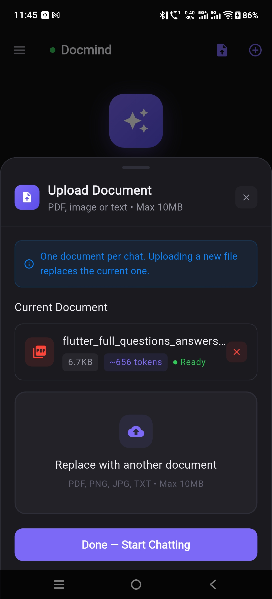
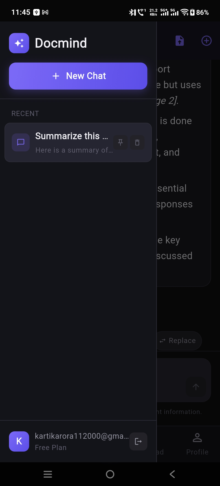

# Docmind

AI-powered conversational document assistant built using Flutter, FastAPI, Supabase, and OpenAI GPT-4o.

Upload a PDF and have a real conversation with it using semantic retrieval, streaming AI responses, and optimized context management.

---

## Features

* Conversational AI over PDFs
* Streaming GPT-4o responses
* Semantic document retrieval
* Page-aware AI responses
* Persistent multi-session chat history
* PDF export support
* Cross-platform Flutter frontend
* Row Level Security using Supabase
* Token-optimized context management
* Parallel embedding pipeline for faster uploads

## Preview

  

## Architecture Overview

Docmind follows a production-style AI architecture with a cross-platform Flutter frontend, FastAPI backend, semantic retrieval pipeline, and GPT-4o streaming responses.

### Frontend (Flutter)

* Single codebase for Android, iOS, and Web
* BLoC state management architecture
* go_router navigation system
* Responsive and adaptive UI
* Supabase authentication integration

### Backend (FastAPI)

* PDF ingestion and processing pipeline
* Semantic chunk retrieval system
* Streaming AI response orchestration
* Context summarization and token optimization
* Parallel embedding generation

### Database & Security (Supabase)

* Persistent chat sessions and messages
* Secure document metadata storage
* Row Level Security (RLS) enforcement
* Authenticated user isolation

### AI Pipeline (OpenAI GPT-4o)

* Embedding-based semantic retrieval
* Context-aware response generation
* Streaming token responses
* Page-aware answer references

## Performance Optimizations

Docmind includes several production-focused optimizations designed to improve performance, reduce AI costs, and maintain scalable conversations.

### Token Optimization

Implemented rolling conversation summarization to reduce token usage by approximately 70% while preserving conversational context.

### Parallel Embedding Pipeline

Document chunks are processed concurrently, reducing upload and embedding generation time by approximately 80%.

### Streaming AI Responses

Responses are streamed token-by-token to improve perceived responsiveness and conversational UX.

### Semantic Retrieval

Only the most relevant document chunks are sent to GPT-4o, reducing unnecessary context size and improving answer quality.

### Context Window Management

Older messages are intelligently summarized to prevent context overflow during long-running conversations.

## Tech Stack

| Layer | Technology |
|---|---|
| Frontend | Flutter |
| State Management | flutter_bloc |
| Navigation | go_router |
| Backend | FastAPI |
| Database | Supabase |
| Authentication | Supabase Auth |
| AI | OpenAI GPT-4o |
| Hosting | Render + Firebase Hosting |
| PDF Processing | PyPDF |
| Export Engine | ReportLab |

## Screenshots

  
  
  

  
  
  

## APK Download

The latest Android release APK will be available through GitHub Releases.

> Coming soon

## Deployment

### Frontend

* Flutter Web deployed using Firebase Hosting

### Backend

* FastAPI backend deployed on Render

### Database & Authentication

* Supabase PostgreSQL + Supabase Auth

### AI Infrastructure

* OpenAI GPT-4o APIs

## Security

* Row Level Security (RLS) enforced on all user data
* Authenticated document ownership validation
* Protected API access patterns
* Environment-based secret management
* Supabase Auth session handling
## Future Improvements

- Multi-document conversations
- OCR support for scanned PDFs
- Voice interaction support
- Team workspaces
- Vector database integration
- Offline caching
- AI-generated document summaries
- Mobile push notifications

## Author

Developed by **Shailendra Shrivastav**

📧 shailendrashrivastava1292@gmail.com  
🔗 [LinkedIn](https://www.linkedin.com/in/shailendra-shrivastav-webdeveloper/)  
🐙 [GitHub](https://github.com/Shailendra122)

If you found this project interesting, feel free to connect or provide feedback.
